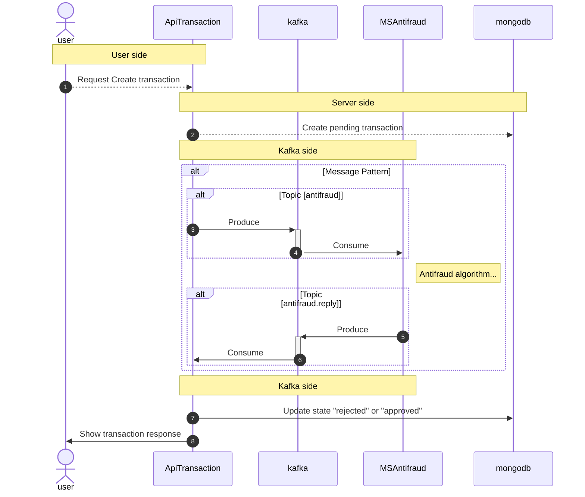

# Yape - Challenge Solution :rocket:

- [Descripción](#Descripción)
- [Instalación](#Instalación)
- [Diagrama de Arquitectura](#Diagrama_de_Arquitectura)

# Descripción

Se realizó una solución que disponibiliza un conjunto un APIs que internamente se comunican
con un microservicio antifraude mediante kafka, toda información generada se almacena en mongobd.

- MongoDb: Base de datos.
- NestJS (api-transaction): Backend y API-Gateway.
- NestJS (ms-antifraud): Microservicio de validación de transacciones.
- confluentinc/cp-kafka: Kafka server.
- provectuslabs/kafka-ui: Web app para administración y GUI de kafka.

# Instalación

Para levantar la infraestructura completa, ejecutar.
NOTA: Modificar .env a conveniencia, los valores por defector desplegan un servicio en el puerto 3000.

```
docker-compose up -d
```

# Diagrama de Arquitectura

El software incluye una implementación de un API-Gateway (backend) que se comunica con el microservicio mediante TRANSPORT.KAFKA.



# Performance testing

Se dejó un plan de pruebas para Apache JMeter.
La aplicación fue testeada con 5K peticiones por segundo.

[File](./docs/Antifraud.jmx)
